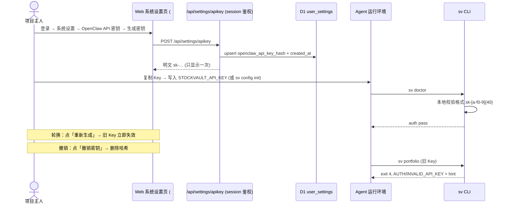

# StockVault CLI 设计文档（`stockvault` / `sv`）

> 状态：**已上线** · 日期：2026-10-05 · 版本：StockVault v2.7.0（新 Agent API `/api/agent/`；旧 `/api/openclaw/*` 已移除）· 回退点：GitHub tag `v2.6.0`
>
> 实施记录：分支 `feat/agent-api-cli` 已合并到 main 并推送，Cloudflare Pages 自动部署；浏览器回归测试通过（仪表盘 KPI/持仓列表/设置页新文案）；14 个开放问题已全部拍板。
>
> 本文档只做设计，不含实现代码。文中所有"现有端点 / 字段 / 行为"都来自对仓库代码的实际阅读，并附上源码位置；
> 所有"新增端点 / 后端修复"都标为**提议**，目前仓库里没有这些东西。

---

## 0. 一页摘要

- **形态**：Node.js 单文件 ESM CLI，零运行时依赖。命令名 `stockvault`，短别名 `sv`。
- **后端**：原有 `/api/openclaw/*` 整组端点**整体移除**（项目主人 2026-10-05 决策，不再修补）；CLI 对接新设计的 Agent API（前缀 `/api/agent/`，见 §8.2），全部只读，走 API Key 鉴权。
- **输出**：默认输出**单行紧凑 JSON**，外面包一层稳定的 envelope（`ok / schemaVersion / command / data / warnings / meta`）。加 `--human` 时输出表格。
- **错误**：JSON 错误对象带上 `type / code / retryable / hint`，并用**分好类的退出码**（0–10）区分参数错误、配置错误、鉴权失败、网络错误、服务端错误等。
- **鉴权**：只从环境变量 `STOCKVAULT_API_KEY`、`STOCKVAULT_API_KEY_FILE` 或配置文件读取 Key。**不提供 `--api-key` 参数**，传了会被直接拒绝。Key 的生成和撤销仍然在 Web「系统设置」页完成。
- **分发**：源码放在仓库 `cli/` 目录。先用 `node cli/stockvault.mjs` 在仓库里直接跑，稳定后发布 npm 包，支持 `npx` 即用。
- **后端前置**（CLI 发布前必须完成）：① 删除 `functions/api/openclaw/` 整组旧端点并清理 middleware；② 按 §8.2 实现新 Agent API 端点（N1–N5）；③ 设置页的 Key 管理端点迁移到 `/api/settings/apikey`。§8.1 列出的旧端点缺陷不再逐个修复，随删除一次性解决。

---

## 1. 设计目标与非目标

### 1.1 目标

| # | 目标 | 衡量标准 |
|---|------|----------|
| G1 | **Agent 不用再自己拼 HTTP 请求** | 7 类查询各有一条命令，参数有校验，错误可分类 |
| G2 | **输出机器可读、契约稳定** | 默认 JSON；有 `schemaVersion`；字段只增不改；`sv describe` 能自描述 |
| G3 | **错误可编程处理** | 退出码 + `error.type` + `error.retryable`，agent 不用解析错误文本 |
| G4 | **薄封装** | 每条数据命令对应 1 个新 Agent API 端点（§8.2）；CLI 不重算金融指标 |
| G5 | **密钥安全** | Key 不进 argv、不进 shell 历史、不进日志；配置文件权限检查；只允许 HTTPS |
| G6 | **人类可调试** | `--human` 表格输出、`--verbose` 打印请求追踪（Key 脱敏）、`sv doctor` 自检 |
| G7 | **省 token** | 紧凑 JSON；`--fields` 字段投影；`--no-trades`、`--limit` 裁剪 |

### 1.2 非目标（第一版不做）

| 非目标 | 原因 |
|--------|------|
| **写入 / 交易记录操作**（新增、修改、删除交易或持仓，平仓） | 见 §1.3 |
| API Key 的生成和撤销 | 这需要主密码换来的 session token。CLI 不应接触主密码，Key 管理保留在 Web 设置页 |
| 在 CLI 里重算 YTD / MTD / 年化等指标 | 违背"薄封装"。口径应由后端统一提供（见 §8.2 `performance`） |
| 触发行情刷新或写快照 | 这属于有副作用的操作（`/api/summary` 会写 `quote_cache` 和 `portfolio_snapshots`），见开放问题 Q5 |
| `watch` 或实时推送 | Agent 场景是一问一答；轮询可以交给调用方或 `/schedule` |
| 本地离线缓存 | 会引入第二层陈旧数据。后端已经有 5 分钟的行情缓存 |
| 投资建议或信号 | 超出数据查询工具的职责 |
| 第一版就做 MCP Server | 第一版先把 CLI 契约做稳定；CLI 的核心模块以后可以复用成 MCP Server（见 §9 Phase 7） |

### 1.3 为什么第一版不做写入 / 交易操作

> 先澄清一点：StockVault 是**记账系统**，不连接券商。所谓"交易操作"是指往账本里写交易记录，不是真实下单。CLI 永远不会、也不能下真实订单。

1. **鉴权模型不支持最小权限**。系统里只有**一把** API Key（`user_settings.openclaw_api_key_hash` 只有一行，见 [apikey.js#L115-L124](functions/api/openclaw/apikey.js#L115-L124)），没有 scope 区分。如果开放写入，任何拿到 Key 的 agent（包括被 prompt injection 的 agent）都能篡改全部账本。
2. **写入逻辑复杂、副作用大**。修改或删除交易会联动重算持仓的数量、均价、开仓汇率和 OPEN/CLOSED 状态（[trades/[id].js#L139-L145](functions/api/trades/[id].js#L139-L145)、[#L242-L250](functions/api/trades/[id].js#L242-L250)），也会影响 YTD 的 lot 匹配（[summary/index.js#L444-L484](functions/api/summary/index.js#L444-L484)）。Agent 一次幻觉写入，后果会沿着这些计算扩散。
3. **缺少安全网**：没有审计日志表，没有软删除或撤销，没有幂等键（重试可能写入重复交易），也没有 dry-run。
4. **OpenClaw API 本身是只读设计**（[README v2.5.0](README.md)），没有可以封装的写端点。CLI 如果去调 session 鉴权的 `/api/trades`，就得持有主密码换来的 token，这违背 G5。

**以后做写入的前提**：多 Key 加 scope（`read` / `write`）→ 审计日志 → 幂等键 → 服务端 dry-run（返回"将会产生的持仓变化"）→ CLI 默认 `--dry-run`，必须显式 `--yes` 才真正写入。

---

## 2. 原有 OpenClaw API 端点盘点（⚠️ 已决策：整体移除）

> **项目主人决策（2026-10-05）**：`/api/openclaw/*` 整组端点不再保留，随 CLI 发布同步下线，不做逐个修复。本节保留盘点内容，作为新端点设计的反面教材和迁移对照。

### 2.1 公共机制（来自 [_middleware.js](functions/api/_middleware.js)）

| 项 | 现状 | 对 CLI 的影响 |
|----|------|---------------|
| 鉴权路由 | `/api/openclaw/*`（`apikey` 除外）走 API Key；`/api/openclaw/apikey` 和其他路由走 session token（[#L132-L163](functions/api/_middleware.js#L132-L163)） | （旧设计）CLI 只能访问这 7 个数据端点；新设计见 §8 |
| Key 传递 | 请求头 `Authorization: Bearer sk-…`；头里没有时**回退到 `?api_key=` 查询参数**（[#L141-L145](functions/api/_middleware.js#L141-L145)） | CLI **只用请求头**。查询参数会出现在访问日志和代理日志里 |
| Key 校验 | 必须以 `sk-` 开头，SHA-256 后和库里的哈希比对（[#L99-L110](functions/api/_middleware.js#L99-L110)） | CLI 可以先在本地校验格式 `^sk-[a-f0-9]{40}$` |
| 401 响应 | `{"success":false,"error":{"code":"MISSING_API_KEY"\|"INVALID_API_KEY","message":"…"}}` | 这里 `error` 是**对象** |
| 各端点 4xx/5xx | `{"success":false,"error":"<字符串>","meta":{…}}` | 这里 `error` 是**字符串**。**两种格式不一致**，CLI 必须兼容（见 §8.1 B1） |
| 未捕获异常 | 中间件兜底返回 `{"success":false,"error":"Internal server error"}`，不带 `meta` | 同上 |
| 成功响应 | `{"success":true,"data":…,"meta":{"timestamp","version":"v1"}}`，列表接口另外带 `count`（`trades` 还带 `total`） | CLI 从 `meta.version` 读出 `apiVersion` |
| 限流 | 后端**没有**限流 | 但仍可能遇到 Cloudflare 平台层的 429 或 5xx |
| 过期 | Key **不会过期**（401 提示文案里写了"已过期"，但实际没有这个机制） | 重新生成或撤销后，旧 Key 立刻失效 |

### 2.2 逐端点评估

README 说"8 个端点"，指的是 7 个数据端点加 1 个 Key 管理端点。

| # | 路径 | 功能 / 数据来源 | 是否够用 | 主要问题 |
|---|------|-----------------|----------|----------|
| 1 | `GET /api/openclaw/portfolio`<br>[portfolio.js](functions/api/openclaw/portfolio.js) | 组合总市值、成本、盈亏、盈亏%、YTD、持仓数、分市场 `{count,valueCNY,pnlCNY}`。只读 `quote_cache` 和 `exchange_rates`，YTD 取 `market='ALL'` 的最新快照 | ⚠️ **基本够用** | ① `lastUpdated` 在没有任何行情缓存时会回退成"当前时间"（[#L196](functions/api/openclaw/portfolio.js#L196)），看起来很新，其实没有数据<br>② 没有当日盈亏、MTD、年化，也没有 YTD% <br>③ 成本用开仓汇率，**和仪表盘口径不一致**（Q2）<br>④ 如果库里没有汇率缓存，会去请求 Frankfurter（[#L71-L85](functions/api/openclaw/portfolio.js#L71-L85)），这和文件头"不发外部请求"的注释不符 |
| 2 | `GET /api/openclaw/positions?market=&status=`<br>[positions.js](functions/api/openclaw/positions.js) | 持仓列表。`market` ∈ `A_SHARE/HK/US/SWISS`，`status` ∈ `OPEN`（默认）/`CLOSED`，参数大小写不敏感。按 `open_date DESC` 排序 | ⚠️ **OPEN 够用；CLOSED 不可用** | ① `status=CLOSED` 时仍然用**当前行情价**算市值和盈亏，没有用 `close_price`/`close_rate_to_cny`（[#L158-L172](functions/api/openclaw/positions.js#L158-L172)），已平仓的盈亏没有意义<br>② 没有权重%、当日盈亏、行情更新时间<br>③ 没有缓存行情时 `currentPrice: null`，但 `valueCNY` 会悄悄退回按开仓价计算 |
| 3 | `GET /api/openclaw/position/:symbol`<br>[position/[symbol].js](functions/api/openclaw/position/[symbol].js) | 单只股票详情加交易流水（`trade_date ASC`）。多了 `sector`、`beta`、`notes` 字段 | ⚠️ **有正确性风险** | ① `SELECT * FROM positions WHERE symbol = ?1` 后直接 `.first()`，没加 `status` 条件也没排序（[#L99-L101](functions/api/openclaw/position/[symbol].js#L99-L101)）。同一代码平仓后再买入会生成新的一行（[positions/index.js#L128](functions/api/positions/index.js#L128)），所以**可能返回旧的 CLOSED 行**<br>② 交易按 `symbol` 而不是 `position_id` 关联，会混入历史持仓的交易<br>③ 交易记录缺少 `id`、`realizedPnl`、`rateToCny` |
| 4 | `GET /api/openclaw/trades?symbol=&market=&type=&from=&to=&limit=&offset=`<br>[trades.js](functions/api/openclaw/trades.js) | 交易流水分页，`limit` 默认 100、最大 500，返回 `count` 和 `total` | ✅ **够用** | ① 只按 `trade_date DESC` 排序，**同一天的多笔交易分页时顺序不稳定**，可能重复或漏掉（[#L83](functions/api/openclaw/trades.js#L83)）<br>② `from`/`to` 不做格式校验，非法日期会按字符串比较，静默返回错误结果<br>③ 缺少 `id`、`positionId`、`realizedPnl`<br>④ 非法 `limit` 会被静默改成默认值，不报错 |
| 5 | `GET /api/openclaw/quote/:symbol`<br>[quote/[symbol].js](functions/api/openclaw/quote/[symbol].js) | 单只股票报价。`quote_cache` 不超过 5 分钟就直接返回，否则请求 Yahoo 并**写回缓存** | ⚠️ **够用但字段少** | ① 只有 `price/previousClose/change/changePercent/currency/cached/updatedAt`，**没有 high/low/volume/name**（SKILL.md 写了 high/low，实际没有）<br>② 只走 Yahoo，不支持 SKILL.md 里提到的 Finnhub / Alpha Vantage<br>③ Yahoo 的所有非 404 失败都统一返回 502，分不清是上游限流还是故障<br>④ 每次调用只查一个代码，批量查询需要 N 次请求<br>⑤ 有副作用：会写 `quote_cache`。这无害，但"只读 API"并不严格只读 |
| 6 | `GET /api/openclaw/markets`<br>[markets.js](functions/api/openclaw/markets.js) | 分市场 `positionCount/totalValueCNY/totalCostCNY/totalPnlCNY/pnlPercent/ytdPnlCNY` | ⚠️ **基本够用** | ① 币种用 `pos.currency`（[#L123](functions/api/openclaw/markets.js#L123)），而 portfolio/positions 都是从 `market` 推导。仪表盘代码注释明确说"DB currency 字段在旧记录上可能是错的"（[summary/index.js#L402](functions/api/summary/index.js#L402)），所以 **markets 的结果可能和 portfolio.markets 对不上**<br>② 兜底汇率和其他端点不同（HKD 0.9231 vs 0.923，CHF 8.1 vs 8.103）<br>③ 缺快照时 `ytdPnlCNY` 返回 `0`，而 portfolio 返回 `null`，语义不一致<br>④ 没有 MTD、YTD%、当日盈亏 |
| 7 | `GET /api/openclaw/snapshots?from=&to=&market=`<br>[snapshots.js](functions/api/openclaw/snapshots.js) | 每日快照，默认最近 90 天，`market` 默认 `ALL` | ✅ **够用** | ① 快照是在**有人打开仪表盘时惰性写入的**（[summary/index.js#L725-L760](functions/api/summary/index.js#L725-L760)），**日期不连续**（只有"日"粒度，SKILL.md 写的"每月"不存在）<br>② 快照日期按 **UTC** 计算（`toISOString()`）<br>③ 返回 `Cache-Control: public, max-age=300`（[#L74](functions/api/openclaw/snapshots.js#L74)），**带鉴权的响应被标成可公共缓存**<br>④ `from`/`to` 不校验 |
| 8 | `GET/POST/DELETE /api/openclaw/apikey`<br>[apikey.js](functions/api/openclaw/apikey.js) | 查询 Key 状态 / 生成（明文只返回一次）/ 撤销。走 **session token** 鉴权 | ➖ **CLI 不使用** | CLI 没有 session token，这个端点只给 Web 设置页用（见 §5.4） |

### 2.3 跨端点的共性问题

| 问题 | 说明 | CLI 的应对 |
|------|------|------------|
| **数据新鲜度不透明** | portfolio、positions、markets 只读 `quote_cache`。这张表只在仪表盘调用 `/api/summary` 或有人调用 `quote` 时刷新。用户几天没打开网页，agent 拿到的就是几天前的价格 | CLI 根据 `lastUpdated` 算出 `meta.dataAsOf`，超过 `--max-age` 时加一条 `STALE_QUOTES` 警告（§4.0.4） |
| **和仪表盘口径不一致** | 仪表盘算成本用**实时汇率**（[summary/index.js#L413-L415](functions/api/summary/index.js#L413-L415)），OpenClaw 用**开仓汇率**。外币持仓的总盈亏会和网页显示不同 | CLI 不纠正（G4），在 `describe` 和 `--help` 里注明口径，并提交开放问题 Q2 |
| **代码格式混用** | 内部格式是 `.SHH/.SHZ/.HKG/.SWX`（导入模板、[constants.js](src/utils/constants.js)），但交易页用 Yahoo 搜索结果时**直接存 Yahoo 格式**（如 `0700.HK`，见 [TradePage.js#L208](src/pages/TradePage.js#L208)）。所以库里很可能两种格式都有 | CLI 不擅自改写代码。查不到时在 `hint` 里给出另一种格式（§4.3） |
| **时间戳格式混用** | `quote_cache.updated_at` 会被两处写入：`/api/summary` 写 `datetime('now')`（`YYYY-MM-DD HH:MM:SS`，UTC，无时区标记），OpenClaw quote 写 ISO-8601 加 `Z` | CLI 把时间戳字段统一规范成 ISO-8601 UTC（带 `Z`）再输出 |
| **代码重复** | `loadRates` / `FALLBACK_RATES` / `MARKET_CURRENCY` 在 4 个文件里各写了一份，而且已经不一致 | 后端修复 B7 |
| **`schema.sql` 漂移** | `portfolio_snapshots` 少了 `ytd_pnl_cny` 列（[schema.sql#L101-L110](db/schema.sql#L101-L110)）。README 说生产库已经加了，但**按 README 全新部署时，snapshots/markets 会 500** | 后端修复 B6。CLI 的集成测试会用到 schema.sql，必须先修 |

---

## 3. CLI 命令总览

调用形式：`sv <command> [args] [flags]`，`stockvault` 和 `sv` 等价。表中"对应端点"指新建的 Agent API（前缀 `/api/agent/`，见 §8.2）；旧 `/api/openclaw/*` 已按决策移除。

### 3.1 数据命令（全部只读）

| 命令 | 用途 | 对应端点 | 关键参数 |
|------|------|----------|----------|
| `sv portfolio` | 组合概要 | `GET /portfolio` | `--max-age` |
| `sv positions` | 持仓列表 | `GET /positions` | `--market` `--status` `--sort` `--asc` `--limit` |
| `sv position <symbol>` | 单只股票详情和流水 | `GET /position/:symbol` | `--no-trades` |
| `sv trades` | 交易流水 | `GET /trades` | `--symbol` `--market` `--type` `--from` `--to` `--last` `--limit` `--offset` `--all` `--max-items` |
| `sv quote <symbol…>` | 实时报价（1–20 个代码） | `GET /quote/:symbol` × N | `--concurrency` |
| `sv markets` | 分市场汇总 | `GET /markets` | `--market` |
| `sv snapshots` | 资产历史快照 | `GET /snapshots` | `--from` `--to` `--last` `--market` |

### 3.2 工具命令（本地运行，或只做连通性检查）

| 命令 | 用途 | 网络访问 |
|------|------|----------|
| `sv doctor` | 自检：配置、Key 格式、连通性、鉴权、数据新鲜度 | 是（见 §4.8） |
| `sv config show` | 显示最终生效的配置（Key 脱敏）以及每项来自哪里 | 否 |
| `sv config path` | 输出配置文件路径 | 否 |
| `sv config init` | 交互式生成配置文件（权限 0600）。Key 从隐藏输入或 stdin 读入 | 否 |
| `sv describe [command]` | 输出机器可读的命令目录：参数、枚举、输出字段、退出码 | 否 |
| `sv version` | 输出 CLI 版本、schemaVersion、支持的 apiVersion | 否 |

### 3.3 全局参数

| 参数 | 默认值 | 说明 |
|------|--------|------|
| `--human` | 关 | 输出人类可读的表格，打到 stdout |
| `--pretty` | 关 | JSON 缩进 2 格，仅用于调试。默认是单行紧凑 JSON |
| `--fields <a,b,…>` | 全部 | 只保留 `data`（或 `data.items[]`）里的指定字段。字段名不认识时报参数错误 |
| `--profile <name>` | 配置里的 `defaultProfile` | 选择配置档，例如 `prod` 或 `local` |
| `--base-url <url>` | 见 §5.2 | 覆盖服务地址（不是秘密，所以允许放在 argv） |
| `--timeout <ms>` | `15000` | 单次 HTTP 请求的超时时间 |
| `--retries <n>` | `2` | 只对可重试的错误生效（§6.4） |
| `--max-age <dur>` | `6h` | 行情超过这个时间就加 `STALE_QUOTES` 警告。支持 `30m`、`6h`、`2d` |
| `--verbose` | 关 | 往 **stderr** 打印请求追踪（URL、状态码、耗时、重试；Key 脱敏） |
| `--raw` | 关 | 调试用：把后端原始响应放进 `data`，不做规范化 |
| `--no-color` | TTY 时开彩色 | 只影响 `--human`。也遵循 `NO_COLOR` 环境变量 |
| `-h, --help` | | 每条命令都有：说明、参数、示例、输出字段、退出码 |
| `-V, --version` | | 等同于 `sv version` |
| ~~`--api-key`~~ | | **故意不提供**。传了会以退出码 2 拒绝，并提示改用环境变量 |

---

## 4. 命令详细设计

### 4.0 通用约定

#### 4.0.1 输出通道

| 模式 | stdout | stderr | 退出码 |
|------|--------|--------|--------|
| 默认（JSON） | **成功和失败都输出一行 JSON envelope** | 只有 `--verbose` 的追踪日志 | §6 |
| `--human` | 表格或可读的错误信息 | 追踪日志 | 同上 |

理由：agent 只需要解析 stdout 这一个流，不用合并 stderr 就能拿到结构化错误；退出码给出快速判断。

#### 4.0.2 成功 envelope（schemaVersion 1）

```json
{
  "ok": true,
  "schemaVersion": 1,
  "command": "portfolio",
  "data": { },
  "warnings": [],
  "meta": {
    "cliVersion": "0.1.0",
    "apiVersion": "v1",
    "baseUrl": "https://finance.snowyegret.top",
    "endpoint": "GET /api/agent/portfolio",
    "serverTimestamp": "2026-10-05T02:20:31.512Z",
    "dataAsOf": "2026-10-04T07:58:12Z",
    "durationMs": 182
  }
}
```

> 本文为了可读性给 JSON 加了缩进。实际默认输出是**单行**，例如：
> `{"ok":true,"schemaVersion":1,"command":"portfolio","data":{…},"warnings":[],"meta":{…}}`

**字段稳定性规则**：

- `ok`、`schemaVersion`、`command`、`data`、`warnings`、`meta` **总是存在**。
- 列表类命令的 `data` 统一是 `{ "items": [...], "count": n, ... }`，不会直接是数组，方便以后加字段时不破坏结构。
- `data` 里的业务字段**直接使用后端 v1 的 camelCase 字段名**（薄封装）。CLI 只做三件事：时间戳规范成 ISO-8601 UTC；`--fields` 投影；包上 envelope。
- 后端新增的字段会**原样透传**（新增不算破坏性变化）。后端缺了某个预期字段时加 `SCHEMA_DRIFT` 警告，不报错。
- 金额字段名都带 `CNY` 后缀，单位是人民币元，保留 2 位小数。`*Percent` 字段是百分数，`16.43` 表示 16.43%。数量和价格用原币种。
- 删除或重命名字段时，`schemaVersion` 必须升级，CLI 同时升一个 major 版本。

#### 4.0.3 错误 envelope

```json
{
  "ok": false,
  "schemaVersion": 1,
  "command": "position",
  "error": {
    "type": "NOT_FOUND",
    "code": "POSITION_NOT_FOUND",
    "message": "Position not found: 0700.HK",
    "httpStatus": 404,
    "retryable": false,
    "hint": "该代码可能以内部格式存储，可尝试 `sv position 0700.HKG`，或用 `sv positions --fields symbol` 查看全部代码"
  },
  "warnings": [],
  "meta": { "cliVersion": "0.1.0", "endpoint": "GET /api/agent/position/0700.HK", "durationMs": 95 }
}
```

`type` 和退出码一一对应，见 §6。

#### 4.0.4 警告（`warnings[]`）

警告不改变退出码，格式统一为 `{ "code": "...", "message": "...", ...上下文 }`。

| code | 触发条件 | 上下文字段 |
|------|----------|------------|
| `STALE_QUOTES` | `dataAsOf` 早于当前时间减 `--max-age` | `dataAsOf`, `ageSeconds` |
| `MISSING_QUOTES` | 有持仓的 `currentPrice` 为 `null`（市值已按开仓价估算） | `symbols[]` |
| `YTD_UNAVAILABLE` | `ytdPnlCNY` 为 `null`（没有快照） | — |
| `CLOSED_PNL_UNRELIABLE` | `positions --status CLOSED`（在 B3 修好之前） | — |
| `TRUNCATED` | `trades --all` 达到 `--max-items` 上限，或 `--limit` 截断了结果 | `returned`, `total` |
| `UNSTABLE_PAGINATION` | `trades` 用了 `offset > 0` 或 `--all`（在 B4 修好之前） | — |
| `SCHEMA_DRIFT` | 后端缺少预期字段 | `missing[]` |
| `INSECURE_CONFIG_PERMS` | 在 POSIX 系统上，配置文件权限比 0600 宽 | `path`, `mode` |

#### 4.0.5 参数校验（在本地完成，不发请求）

| 类型 | 规则 | 失败时 |
|------|------|--------|
| `market` | 大小写不敏感，取值 `A_SHARE`、`HK`、`US`、`SWISS`（`snapshots` 额外允许 `ALL`） | 退出码 2，`INVALID_ARGUMENT`，并列出合法值 |
| 日期 | 必须严格是 `YYYY-MM-DD` 且是合法日期；`from ≤ to` | 退出码 2 |
| `--last` | `\d+[dwmy]`，例如 `30d`、`12w`、`6m`、`1y`。按 **UTC** 日期算出 `from`，和后端快照日期口径一致（Q6）。不能和 `--from` 同时使用 | 退出码 2 |
| symbol | 去掉首尾空格、转大写、URL 编码；只允许 `[A-Z0-9.^:_-]`，长度 1–32 | 退出码 2 |

---

### 4.1 `sv portfolio`

**说明**：组合概要。数据来自行情缓存，速度快，但可能不是最新价格（见 `meta.dataAsOf`）。

**参数**：只有全局参数（常用 `--max-age`、`--fields`）。

**示例**：
```bash
sv portfolio
sv portfolio --fields totalValueCNY,totalPnlPercent,ytdPnlCNY
sv portfolio --human
```

**JSON 输出示例**：
```json
{
  "ok": true, "schemaVersion": 1, "command": "portfolio",
  "data": {
    "totalValueCNY": 1283456.78,
    "totalCostCNY": 1102345.12,
    "totalPnlCNY": 181111.66,
    "totalPnlPercent": 16.43,
    "ytdPnlCNY": 95321.40,
    "positionCount": 18,
    "markets": {
      "A_SHARE": { "count": 6, "valueCNY": 402311.50, "pnlCNY": 35210.20 },
      "HK":      { "count": 4, "valueCNY": 188420.00, "pnlCNY": -12030.55 },
      "US":      { "count": 7, "valueCNY": 621905.28, "pnlCNY": 151820.01 },
      "SWISS":   { "count": 1, "valueCNY": 70820.00,  "pnlCNY": 6112.00 }
    },
    "lastUpdated": "2026-10-04T07:58:12Z"
  },
  "warnings": [
    { "code": "STALE_QUOTES", "message": "行情缓存距今约 18.4 小时，超过 --max-age=6h；打开 Web 仪表盘可刷新", "dataAsOf": "2026-10-04T07:58:12Z", "ageSeconds": 66139 }
  ],
  "meta": { "cliVersion": "0.1.0", "apiVersion": "v1", "endpoint": "GET /api/agent/portfolio", "dataAsOf": "2026-10-04T07:58:12Z", "durationMs": 182 }
}
```

**`--human` 输出示例**：
```
组合概要  (行情截至 2026-10-04 15:58 CST，⚠ 已过期 18.4h)
  总市值   ¥1,283,456.78     总成本  ¥1,102,345.12
  总盈亏   ¥+181,111.66 (+16.43%)   YTD  ¥+95,321.40   持仓 18 只

MARKET   COUNT        VALUE(CNY)       PNL(CNY)
A_SHARE      6        402,311.50     +35,210.20
HK           4        188,420.00     -12,030.55
US           7        621,905.28    +151,820.01
SWISS        1         70,820.00      +6,112.00
```

---

### 4.2 `sv positions`

**说明**：持仓列表，默认只列当前持仓（OPEN）。

| 参数 | 类型 | 默认 | 说明 | 透传给后端？ |
|------|------|------|------|--------------|
| `--market <m>` | 枚举 | 全部 | `A_SHARE`/`HK`/`US`/`SWISS` | ✅ `market` |
| `--status <s>` | 枚举 | `OPEN` | `OPEN`/`CLOSED`。CLOSED 在 B3 修复前会附带警告 | ✅ `status` |
| `--sort <field>` | 枚举 | 保持后端顺序（`openDate` 降序） | `valueCNY`/`pnlCNY`/`pnlPercent`/`costCNY`/`symbol`/`openDate` | ❌ 客户端排序 |
| `--asc` | 开关 | 降序 | 改为升序 | ❌ |
| `--limit <n>` | 整数 ≥1 | 不限 | 排序后截取前 n 条，被截断时加 `TRUNCATED` 警告 | ❌ |

> 客户端排序和截取只是重新排列后端返回的行，不产生新的计算值，仍然符合薄封装（G4）。

**示例**：
```bash
sv positions
sv positions --market US --sort pnlPercent --limit 5          # 美股收益率前 5
sv positions --sort pnlCNY --asc --limit 3                    # 亏损最多的 3 只
sv positions --fields symbol,name,valueCNY,pnlPercent --human
```

**JSON 输出示例**：
```json
{
  "ok": true, "schemaVersion": 1, "command": "positions",
  "data": {
    "items": [
      {
        "symbol": "AAPL", "name": "Apple Inc.", "market": "US", "currency": "USD",
        "quantity": 120, "openPrice": 168.20, "currentPrice": 231.45,
        "costCNY": 145012.30, "valueCNY": 199871.22, "pnlCNY": 54858.92, "pnlPercent": 37.83,
        "openDate": "2025-03-14", "status": "OPEN"
      },
      {
        "symbol": "0700.HKG", "name": "腾讯控股", "market": "HK", "currency": "HKD",
        "quantity": 200, "openPrice": 380.00, "currentPrice": null,
        "costCNY": 70196.15, "valueCNY": 70148.00, "pnlCNY": -48.15, "pnlPercent": -0.07,
        "openDate": "2026-03-10", "status": "OPEN"
      }
    ],
    "count": 2,
    "filter": { "market": null, "status": "OPEN" }
  },
  "warnings": [
    { "code": "MISSING_QUOTES", "message": "1 只持仓无缓存行情，市值按开仓价估算", "symbols": ["0700.HKG"] }
  ],
  "meta": { "cliVersion": "0.1.0", "apiVersion": "v1", "endpoint": "GET /api/agent/positions?status=OPEN", "durationMs": 141 }
}
```

---

### 4.3 `sv position <symbol>`

**说明**：单只股票的持仓详情和全部交易流水。

| 参数 | 说明 |
|------|------|
| `<symbol>` | 必填，原样透传（只做大写化和 URL 编码） |
| `--no-trades` | 输出时去掉 `trades` 数组，省 token（仍然是同一次请求） |

**代码格式处理**：CLI **不会自动改写**代码，因为库里两种格式可能都有（§2.3）。后端返回 404 时，CLI 用下面的映射算出"另一种格式"，写进 `error.hint`：

| 内部格式 | Yahoo 格式 |
|----------|-----------|
| `.SHH` | `.SS` |
| `.SHZ` | `.SZ` |
| `.HKG` | `.HK` |
| `.SWX` | `.SW` |

用户常写的 `.SH` 也会提示对应的 `.SHH` 或 `.SS`。是否改成自动重试，见 Q4。

**示例**：
```bash
sv position AAPL
sv position 600519.SHH --no-trades
sv position 0700.HKG --human
```

**JSON 输出示例**：
```json
{
  "ok": true, "schemaVersion": 1, "command": "position",
  "data": {
    "symbol": "600519.SHH", "name": "贵州茅台", "market": "A_SHARE", "currency": "CNY",
    "quantity": 100, "openPrice": 1850.00, "openDate": "2026-01-15",
    "currentPrice": 1712.30,
    "costCNY": 185005.00, "valueCNY": 171230.00, "pnlCNY": -13775.00, "pnlPercent": -7.45,
    "sector": "消费", "beta": 0.85, "notes": "长期持有", "status": "OPEN",
    "trades": [
      { "type": "BUY", "price": 1850.00, "quantity": 100, "date": "2026-01-15", "commission": 5.00, "notes": "长期持有" }
    ]
  },
  "warnings": [],
  "meta": { "cliVersion": "0.1.0", "apiVersion": "v1", "endpoint": "GET /api/agent/position/600519.SHH", "durationMs": 118 }
}
```

> 已知风险：在 B2 修好之前，如果同一个代码有多条持仓记录，后端可能返回已平仓的那条。CLI 发现 `status === "CLOSED"` 但用户没有显式要求时，会加一条 `AMBIGUOUS_POSITION` 警告。

---

### 4.4 `sv trades`

**说明**：交易流水，按交易日期倒序。

| 参数 | 类型 | 默认 | 说明 |
|------|------|------|------|
| `--symbol <s>` | 字符串 | — | 透传 `symbol` |
| `--market <m>` | 枚举 | — | 透传 `market` |
| `--type <t>` | `BUY`/`SELL` | — | 透传 `type` |
| `--from <date>` / `--to <date>` | `YYYY-MM-DD` | — | 透传，CLI 先校验格式 |
| `--last <dur>` | `30d`/`12w`/`6m`/`1y` | — | 语法糖，换算成 `from`；不能和 `--from` 同时用 |
| `--limit <n>` | 1–500 | 100 | 超出范围直接**报错**（后端会静默修正，CLI 不这样做） |
| `--offset <n>` | ≥0 | 0 | 透传 |
| `--all` | 开关 | 关 | 每页 500 条自动翻页，直到取完 `total` 或达到 `--max-items`。不能和 `--offset` 同时用 |
| `--max-items <n>` | 整数 | 5000 | `--all` 的安全上限 |

**示例**：
```bash
sv trades --last 30d
sv trades --symbol AAPL --type SELL
sv trades --market HK --from 2026-01-01 --to 2026-06-30 --all
sv trades --limit 20 --fields date,symbol,type,price,quantity --human
```

**JSON 输出示例**：
```json
{
  "ok": true, "schemaVersion": 1, "command": "trades",
  "data": {
    "items": [
      { "symbol": "AAPL", "name": "Apple Inc.", "market": "US", "type": "SELL", "price": 228.10, "quantity": 30, "commission": 1.00, "currency": "USD", "date": "2026-09-22", "notes": null },
      { "symbol": "0700.HKG", "name": "腾讯控股", "market": "HK", "type": "BUY", "price": 412.40, "quantity": 100, "commission": 50.00, "currency": "HKD", "date": "2026-09-18", "notes": "加仓" }
    ],
    "count": 2,
    "total": 2,
    "pagination": { "limit": 100, "offset": 0, "pagesFetched": 1, "hasMore": false },
    "filter": { "symbol": null, "market": null, "type": null, "from": "2026-09-05", "to": null }
  },
  "warnings": [],
  "meta": { "cliVersion": "0.1.0", "apiVersion": "v1", "endpoint": "GET /api/agent/trades?from=2026-09-05&limit=100&offset=0", "durationMs": 97 }
}
```

`hasMore` 的计算方式是 `offset + count < total`，agent 可以据此决定要不要继续翻页。

---

### 4.5 `sv quote <symbol…>`

**说明**：实时报价。后端有 5 分钟缓存，缓存过期时会请求 Yahoo Finance。

| 参数 | 默认 | 说明 |
|------|------|------|
| `<symbol…>` | 必填，1–20 个 | 多个代码用空格分隔 |
| `--concurrency <n>` | 3 | 并发请求数（1–5），避免触发 Yahoo 限流 |

**多代码语义**：
- 只有一个代码时：失败就是普通错误（404 → 退出码 5，502 → 退出码 7）。
- 多个代码时：结果放在 `data.items[]`，失败的放在 `data.errors[]`。全部成功退出码 0；**部分失败退出码 10（`PARTIAL`）且 `ok: true`**；全部失败时按"最严重的错误类型"给退出码，`ok: false`。
- 在新增批量端点（§8.2 N2）之前，每个代码对应一次 HTTP 请求。

**示例**：
```bash
sv quote AAPL
sv quote AAPL MSFT 0700.HKG 600519.SHH
sv quote $(sv positions --fields symbol | jq -r '.data.items[].symbol')   # 查所有持仓的报价
```

**JSON 输出示例**（部分失败）：
```json
{
  "ok": true, "schemaVersion": 1, "command": "quote", "partial": true,
  "data": {
    "items": [
      { "symbol": "AAPL", "price": 231.45, "previousClose": 229.80, "change": 1.65, "changePercent": 0.72, "currency": "USD", "cached": true, "updatedAt": "2026-10-05T02:17:03Z" },
      { "symbol": "0700.HKG", "price": 418.20, "previousClose": 421.00, "change": -2.80, "changePercent": -0.67, "currency": "HKD", "cached": false, "updatedAt": "2026-10-05T02:20:31Z" }
    ],
    "errors": [
      { "symbol": "FOO.BAR", "type": "NOT_FOUND", "code": "SYMBOL_NOT_FOUND", "httpStatus": 404, "retryable": false, "message": "Symbol not found: FOO.BAR" }
    ],
    "count": 2
  },
  "warnings": [],
  "meta": { "cliVersion": "0.1.0", "apiVersion": "v1", "endpoint": "GET /api/agent/quote/:symbol ×3", "durationMs": 640 }
}
```
退出码：`10`。

---

### 4.6 `sv markets`

**说明**：分市场汇总（只统计当前持仓）。

| 参数 | 说明 |
|------|------|
| `--market <m>` | 客户端过滤，只保留一个市场 |

**示例**：
```bash
sv markets
sv markets --market US --human
```

**JSON 输出示例**：
```json
{
  "ok": true, "schemaVersion": 1, "command": "markets",
  "data": {
    "markets": {
      "A_SHARE": { "positionCount": 6, "totalValueCNY": 402311.50, "totalCostCNY": 367101.30, "totalPnlCNY": 35210.20, "pnlPercent": 9.59, "ytdPnlCNY": 21003.10 },
      "US":      { "positionCount": 7, "totalValueCNY": 621905.28, "totalCostCNY": 470085.27, "totalPnlCNY": 151820.01, "pnlPercent": 32.30, "ytdPnlCNY": 70112.44 }
    }
  },
  "warnings": [],
  "meta": { "cliVersion": "0.1.0", "apiVersion": "v1", "endpoint": "GET /api/agent/markets", "durationMs": 133 }
}
```

> 后端返回的是以市场为 key 的对象，CLI 放到 `data.markets` 下保持原结构，不改成数组。这和 `portfolio.data.markets` 的结构一致。

---

### 4.7 `sv snapshots`

**说明**：资产历史快照，按日期升序。快照只在有人打开 Web 仪表盘的日子才会写入，**日期可能不连续**。

| 参数 | 默认 | 说明 |
|------|------|------|
| `--from` / `--to` | 后端默认：最近 90 天 | `YYYY-MM-DD` |
| `--last <dur>` | — | 语法糖，不能和 `--from` 同时用 |
| `--market <m>` | `ALL` | `ALL`/`A_SHARE`/`HK`/`US`/`SWISS` |

**示例**：
```bash
sv snapshots --last 30d
sv snapshots --market US --from 2026-01-01
sv snapshots --last 1y --fields date,totalValueCNY,totalPnlCNY
```

**JSON 输出示例**：
```json
{
  "ok": true, "schemaVersion": 1, "command": "snapshots",
  "data": {
    "items": [
      { "date": "2026-09-28", "totalValueCNY": 1251020.11, "totalCostCNY": 1098011.00, "totalPnlCNY": 153009.11, "ytdPnlCNY": 81200.50, "positionCount": 18 },
      { "date": "2026-10-04", "totalValueCNY": 1283456.78, "totalCostCNY": 1102345.12, "totalPnlCNY": 181111.66, "ytdPnlCNY": 95321.40, "positionCount": 18 }
    ],
    "count": 2,
    "filter": { "market": "ALL", "from": "2026-09-05", "to": "2026-10-05" }
  },
  "warnings": [],
  "meta": { "cliVersion": "0.1.0", "apiVersion": "v1", "endpoint": "GET /api/agent/snapshots?from=2026-09-05&market=ALL", "durationMs": 88 }
}
```

CLI **不会补齐缺失的日期**（不做插值）。

---

### 4.8 `sv doctor`

**说明**：一次性自检。适合 agent 首次配置时运行，也适合排查问题时运行。

| 检查项 | 方法 | 失败时 |
|--------|------|--------|
| `config` | 解析配置来源；Key 存在且格式为 `^sk-[a-f0-9]{40}$` | `CONFIG` |
| `baseUrl` | 是 HTTPS，或者是 `localhost`/`127.0.0.1` | `CONFIG` |
| `connectivity` + `auth` | 优先调 `GET /api/agent/ping`（§8.2 N1）。没有这个端点时，回退调用 `GET /snapshots?from=<今天>&to=<今天>`（纯数据库查询，最轻） | `NETWORK` / `AUTH` / `PROTOCOL` |
| `freshness` | 调 `GET /portfolio`，读取 `lastUpdated` | 只警告 |
| `configPerms` | POSIX 系统上检查配置文件权限是否为 0600 | 只警告 |

**输出示例**：
```json
{
  "ok": true, "schemaVersion": 1, "command": "doctor",
  "data": {
    "checks": [
      { "name": "config", "status": "pass", "detail": "apiKey from env STOCKVAULT_API_KEY (sk-…3f9a)" },
      { "name": "baseUrl", "status": "pass", "detail": "https://finance.snowyegret.top (from default)" },
      { "name": "auth", "status": "pass", "detail": "200 in 143ms via /snapshots fallback" },
      { "name": "freshness", "status": "warn", "detail": "quotes 18.4h old" }
    ]
  },
  "warnings": [],
  "meta": { "cliVersion": "0.1.0", "durationMs": 391 }
}
```

退出码取第一项失败检查对应的退出码；只有警告时退出码为 0。

---

### 4.9 `sv describe [command]` 与 `--help`

- `sv <cmd> --help`：给人看的文本，包括一句话说明、参数表、**至少 2 个示例**、输出字段说明（含单位和口径）、可能的退出码。
- `sv describe`：给 agent 看的 JSON 目录，agent 可以据此自己发现能力，不用读文档：

```json
{
  "ok": true, "schemaVersion": 1, "command": "describe",
  "data": {
    "cliVersion": "0.1.0",
    "supportedApiVersions": ["v1"],
    "commands": [
      {
        "name": "positions",
        "summary": "List positions (default OPEN)",
        "endpoint": "GET /api/agent/positions",
        "args": [],
        "flags": [
          { "name": "--market", "type": "enum", "values": ["A_SHARE","HK","US","SWISS"], "required": false },
          { "name": "--status", "type": "enum", "values": ["OPEN","CLOSED"], "default": "OPEN" },
          { "name": "--sort", "type": "enum", "values": ["valueCNY","pnlCNY","pnlPercent","costCNY","symbol","openDate"] },
          { "name": "--limit", "type": "integer", "min": 1 }
        ],
        "output": {
          "itemFields": {
            "symbol": "string", "name": "string", "market": "enum", "currency": "string",
            "quantity": "number", "openPrice": "number(native)", "currentPrice": "number(native)|null",
            "costCNY": "number(CNY, cost at open FX rate)", "valueCNY": "number(CNY, live FX)",
            "pnlCNY": "number(CNY)", "pnlPercent": "number(percent, 12.3 = 12.3%)",
            "openDate": "date", "status": "enum"
          }
        },
        "examples": ["sv positions --market US --sort pnlPercent --limit 5"]
      }
    ],
    "exitCodes": { "0": "OK", "2": "USAGE", "3": "CONFIG", "4": "AUTH", "5": "NOT_FOUND", "6": "NETWORK", "7": "SERVER", "8": "RATE_LIMITED", "9": "PROTOCOL", "10": "PARTIAL", "1": "INTERNAL" }
  }
}
```

### 4.10 `sv config …` / `sv version`

```bash
sv config path                         # 输出 ~/.config/stockvault/config.json
sv config show                         # 输出最终配置，Key 只显示末 4 位，每项注明来源（flag/env/file/default）
sv config init                         # 交互式：问 base URL → 隐藏输入 Key → 写入文件并 chmod 600
sv config init --key-stdin < key.txt   # 非交互：从 stdin 读 Key
sv version                             # {"cliVersion":"0.1.0","schemaVersion":1,"supportedApiVersions":["v1"],"node":"v22.x"}
```

---

## 5. 鉴权方案

### 5.1 Key 的来源与优先级（从高到低）

| 优先级 | 来源 | 说明 |
|--------|------|------|
| 1 | `STOCKVAULT_API_KEY` 环境变量 | **推荐给 agent**。在 agent 运行时或 CI secret 中注入 |
| 2 | `STOCKVAULT_API_KEY_FILE` 环境变量 | 指向一个只含 Key 的文件，适配 Docker/K8s secret 挂载。读取后去掉首尾空白 |
| 3 | 配置文件中当前 profile 的 `apiKeyFile` | 同上 |
| 4 | 配置文件中当前 profile 的 `apiKey` | 方便本机人工使用 |
| ✗ | 命令行参数 | **不支持**。`--api-key` 或 `--key` 会以退出码 2 拒绝，提示 `Key 不能通过命令行传入（会进入 shell 历史和进程列表），请使用 STOCKVAULT_API_KEY` |

### 5.2 Base URL 的优先级

`--base-url` 参数 → `STOCKVAULT_BASE_URL` → 配置文件中 profile 的 `baseUrl` → 内置默认值 `https://finance.snowyegret.top`（默认值是否保留见 Q1）。

**安全约束**：必须是 `https://`；只有主机名是 `localhost`、`127.0.0.1` 或 `[::1]` 时才允许 `http://`（本地开发用 `wrangler pages dev`，默认 `http://localhost:8788`）。否则以 `CONFIG` 错误拒绝，防止 Key 通过明文传输泄露。

### 5.3 配置文件

- **路径**：`$XDG_CONFIG_HOME/stockvault/config.json`，没设时用 `~/.config/stockvault/config.json`；Windows 用 `%APPDATA%\stockvault\config.json`。仓库里有 `start_dev.bat`、`sync_db.bat`，说明项目主人在用 Windows，所以 Windows 路径必须支持。
- **可覆盖**：`STOCKVAULT_CONFIG=/path/to/config.json`。
- **格式**：
  ```json
  {
    "defaultProfile": "prod",
    "profiles": {
      "prod":  { "baseUrl": "https://finance.snowyegret.top", "apiKey": "sk-…" },
      "local": { "baseUrl": "http://localhost:8788", "apiKeyFile": "~/.config/stockvault/local.key" }
    }
  }
  ```
- **权限**：`config init` 写文件时设为 `0600`、目录设为 `0700`。在 POSIX 上发现权限过宽时给 `INSECURE_CONFIG_PERMS` 警告（不阻断）。Windows 上跳过这项检查。
- **profile 选择**：`--profile` → `STOCKVAULT_PROFILE` → `defaultProfile`。

### 5.4 与 Web「系统设置」页的衔接



要点：

1. **生成**：只能在 Web 端完成（[SettingsPage.js#L304-L344](src/pages/SettingsPage.js#L304-L344)）。CLI 的 `--help`、`doctor` 和鉴权错误的 `hint` 都会给出具体路径：`<baseUrl>/#/settings → OpenClaw API 密钥`。
2. **单 Key 的影响**：系统只存一个哈希，**重新生成就等于轮换**，所有使用旧 Key 的 agent 会同时失效。CLI 遇到 `INVALID_API_KEY` 时的 hint：
   > `API Key 无效。可能原因：①Key 已在系统设置页被重新生成或撤销；②复制不完整。请到 <baseUrl>/#/settings 生成新 Key 并更新 STOCKVAULT_API_KEY。`
3. **撤销**：同上，撤销后立即生效，CLI 侧不需要任何操作。
4. **设置页文案更新**（实施时做）：在现有的「📡 API 使用方式」卡片（[SettingsPage.js#L164-L175](src/pages/SettingsPage.js#L164-L175)）里，除了 `curl` 示例，再加一段 CLI 用法，例如 `export STOCKVAULT_API_KEY=sk-… && npx stockvault-cli doctor`。
5. **CLI 不提供** `sv key generate/revoke`，理由见 §1.2。

### 5.5 Key 防泄露清单

- 只通过 `Authorization` 请求头发送，**绝不**使用 `?api_key=`。
- `--verbose` 日志、`config show`、`doctor` 输出、错误 envelope 里，Key 一律显示为 `sk-…<末4位>`。
- 错误信息不回显请求头。
- 不跟随跨域重定向（`redirect: "manual"`）；遇到 3xx 返回 `PROTOCOL` 错误，避免 Key 被转发给第三方主机。
- 不往磁盘写任何响应缓存。

---

## 6. 错误处理与退出码规范

### 6.1 退出码表

| 退出码 | `error.type` | 含义 | 典型 `error.code` | 默认 `retryable` |
|--------|--------------|------|-------------------|------------------|
| **0** | — | 成功（可能带 `warnings`） | — | — |
| **1** | `INTERNAL` | CLI 自身的未预期异常（bug） | `UNEXPECTED` | false |
| **2** | `USAGE` | 参数错误：未知命令或参数、枚举值非法、日期非法、传了 `--api-key`、后端返回 400 | `INVALID_ARGUMENT`, `UNKNOWN_COMMAND`, `FORBIDDEN_FLAG`, `SERVER_REJECTED_ARGUMENT` | false |
| **3** | `CONFIG` | 本地配置问题：没有 Key、Key 格式不对、Base URL 非法或非 HTTPS、配置文件读不了或 JSON 错误 | `MISSING_API_KEY`, `INVALID_API_KEY_FORMAT`, `INSECURE_BASE_URL`, `CONFIG_PARSE_ERROR` | false |
| **4** | `AUTH` | 服务端鉴权失败（401/403） | `MISSING_API_KEY`, `INVALID_API_KEY`, `FORBIDDEN` | false |
| **5** | `NOT_FOUND` | 资源不存在（后端返回了 JSON 格式的 404） | `POSITION_NOT_FOUND`, `SYMBOL_NOT_FOUND` | false |
| **6** | `NETWORK` | 请求没有得到 HTTP 响应：DNS 失败、连接被拒、TLS 错误、超时 | `DNS_FAILURE`, `CONNECTION_REFUSED`, `TLS_ERROR`, `TIMEOUT` | **true** |
| **7** | `SERVER` | 服务端 5xx，包括 502 上游行情失败 | `SERVER_ERROR`, `UPSTREAM_QUOTE_FAILED`, `SERVICE_UNAVAILABLE` | 500 为 false；502/503/504 为 **true** |
| **8** | `RATE_LIMITED` | 429（平台层限流） | `RATE_LIMITED` | **true**（遵循 `Retry-After`） |
| **9** | `PROTOCOL` | 有响应但不符合契约：不是 JSON（比如拿到了 HTML 页面）、缺少 `success` 字段、3xx 重定向 | `NON_JSON_RESPONSE`, `MALFORMED_ENVELOPE`, `UNEXPECTED_REDIRECT` | false |
| **10** | — | 批量操作部分成功（目前只有 `quote` 多代码时会出现），`ok: true, partial: true` | — | — |

退出码避开了 126、127 和 128 以上的值，这些是 shell 保留的。

### 6.2 HTTP 响应到错误类型的映射

| 后端响应 | 判定 |
|----------|------|
| 2xx，JSON，`success: true` | 成功 |
| 2xx，但 `Content-Type` 不是 JSON | `PROTOCOL/NON_JSON_RESPONSE`。**推断**：路径写错或端点没部署时，Pages 可能会用 SPA 回退返回 `index.html`。hint 提示检查 `baseUrl` 和后端版本 |
| 400 | `USAGE/SERVER_REJECTED_ARGUMENT`。`message` 透传后端文本（说明 CLI 的本地校验漏了这种情况，应该补上） |
| 401，`error.code` 是 `MISSING_API_KEY` 或 `INVALID_API_KEY` | `AUTH`，`code` 透传 |
| 404，路径是 `/position/*` | `NOT_FOUND/POSITION_NOT_FOUND`，加上代码格式 hint |
| 404，路径是 `/quote/*` | `NOT_FOUND/SYMBOL_NOT_FOUND` |
| 404，不是 JSON | `PROTOCOL`（端点不存在） |
| 429 | `RATE_LIMITED` |
| 500 | `SERVER/SERVER_ERROR` |
| 502，路径是 `/quote/*` | `SERVER/UPSTREAM_QUOTE_FAILED`，可重试 |
| 503 / 504 | `SERVER/SERVICE_UNAVAILABLE`，可重试 |
| `fetch` 抛出异常 | 按 `cause.code` 细分：`ENOTFOUND` → `DNS_FAILURE`，`ECONNREFUSED` → `CONNECTION_REFUSED`，TLS 相关错误码 → `TLS_ERROR`，`AbortError` → `TIMEOUT`，都归为 `NETWORK` |

**兼容两种后端错误格式**：后端 `error` 是对象时取 `error.code` 和 `error.message`；是字符串时，`message` 就用这个字符串，`code` 按上表推断。

### 6.3 `message` 的语言

- `error.code` 和 `error.type`：固定的英文枚举，是**机器契约**。
- `error.message`：后端有文本就透传（目前中英混杂）；CLI 自己产生的错误使用中文（Q12）。
- `error.hint`：中文，给出可操作的下一步。

### 6.4 超时与重试

- 每次请求的超时由 `--timeout` 控制（默认 15 秒，`quote` 命令会等 Yahoo 回源）。
- 只有 `retryable: true` 的错误才会重试，最多重试 `--retries` 次（默认 2），指数退避（500ms、1500ms，带随机抖动）。429 时优先遵循 `Retry-After`，但单次等待不超过 10 秒。
- 所有端点都是 GET，可以安全重试。`quote` 唯一的副作用是写缓存，属于幂等操作。
- `--verbose` 会把每次重试记录到 stderr。

---

## 7. 分发与安装方案

### 7.1 方案比较

| 方案 | 安装 | 优点 | 缺点 |
|------|------|------|------|
| A. **npm 包加 `bin`**（`npm i -g` 或 `npx`） | `npx -y stockvault-cli@0.1 portfolio` | Agent 环境普遍有 Node；`npx` 不用装；版本可以锁定；跨平台（包括 Windows） | `npx` 首次运行要 1–3 秒下载；需要 npm 账号和包名 |
| B. **单文件脚本**（仓库 `cli/stockvault.mjs`，也放进 `public/` 下供下载） | `curl -O https://<site>/stockvault.mjs && node stockvault.mjs portfolio` | 没有发布流程；和后端同仓库同版本；可以像现在的 `SKILL.md` 一样从设置页下载 | 不能自动更新；不同用户的版本可能不一致；没有完整性校验（除非另外提供 sha256） |
| C. 预编译二进制（Node SEA 或 `bun build --compile`） | 下载对应平台的二进制 | 不需要 Node | 每个平台 50–90 MB，要维护 CI 构建矩阵，这个规模不划算 |
| D. Python 包 | `pipx install` | Python agent 生态很大 | 和项目的 JS 技术栈割裂，后端校验逻辑无法共享 |

### 7.2 推荐：**A 和 B 共用同一份源码，分两步走**

1. **源码形态**：`cli/stockvault.mjs` 是**单文件、零运行时依赖**的 ESM。只用 Node 内置能力：全局 `fetch`、`node:util` 的 `parseArgs`、`node:fs`、`node:os`、`node:readline`。
   - 理由：零依赖意味着 `npx` 冷启动最快、没有供应链风险、单文件可以直接下载运行。
2. **Phase 1（仓库内使用）**：`node cli/stockvault.mjs …`。同时把这个文件拷贝到构建产物里，让设置页可以像下载 `SKILL.md` 一样下载。
3. **Phase 2（发布 npm）**：`cli/package.json` 声明 `"bin": { "stockvault": "./stockvault.mjs", "sv": "./stockvault.mjs" }`，`"engines": { "node": ">=22" }`，`"files": ["stockvault.mjs","README.md"]`。包名待定（Q7），候选：`stockvault-cli` 或 `@snowyegret/stockvault`。
4. **和主项目隔离**：根目录 `package.json` 是 `"private": true` 的 Vite 应用。CLI 使用独立的 `cli/package.json`，不影响 `npm run build`，也不会进入 Pages 产物（单文件下载副本除外）。
5. **给 agent 的建议用法**：
   - 高频调用：`npm i -g stockvault-cli@0.1`，避免每次都经过 `npx`。
   - 偶尔调用：`npx -y stockvault-cli@0.1 …`，**锁定 minor 版本**，保证 `schemaVersion` 不变。
6. **Node 版本**：要求 `>=22`。到 2026-10，Node 20 已经停止维护（2026-04），22 处于维护 LTS，24 是活跃 LTS。见 Q7。

---

## 8. 后端改动：移除旧端点 + 新建 Agent API

### 8.0 移除计划

| 步骤 | 内容 |
|------|------|
| R1 | 删除 `functions/api/agent/` 整个目录（7 个数据端点 + apikey 管理端点） |
| R2 | 清理 `functions/api/_middleware.js` 里针对 `/api/agent/*` 的鉴权分支（含 `?api_key=` 回退逻辑） |
| R3 | 设置页的 Key 生成/撤销/状态查询迁移到新路径 `/api/settings/apikey`，保持 session token 鉴权不变（见 §5.4） |
| R4 | 两份 SKILL.md（`.agents/skills/stockvault/SKILL.md`、`public/SKILL.md`）删除旧端点文档，改为"优先使用 CLI" |
| R5 | 设置页「API 使用方式」卡片更新为 CLI 方式；根 README 版本日志记录此次 breaking change |

### 8.1 旧端点的已知缺陷（不再逐个修复，随 R1 删除；新端点必须避开这些坑）

| ID | 优先级 | 问题 | 新端点的对应要求 | 涉及文件 |
|----|--------|------|----------|----------|
| B1 | **P0** | 错误格式不统一（对象 vs 字符串） | 所有 OpenClaw 响应统一为 `{"success":false,"error":{"code","message"},"meta":{…}}`。CLI 会继续兼容旧格式 | `_middleware.js`、7 个端点 |
| B2 | **P0** | `position/:symbol` 可能返回 CLOSED 行；交易混入历史持仓 | 优先 `status='OPEN'`，其次 `open_date DESC`；交易按 `position_id` 关联；支持可选 `?status=` | `position/[symbol].js` |
| B3 | **P0** | `positions?status=CLOSED` 用当前价计算盈亏 | CLOSED 行改用 `close_price` 和 `close_rate_to_cny`，并返回 `closeDate`、`closePrice`、`realizedPnlCNY` | `positions.js` |
| B4 | P1 | `trades` 分页顺序不稳定 | 改为 `ORDER BY trade_date DESC, created_at DESC, id DESC`；响应增加 `id`、`positionId`、`realizedPnl`、`rateToCny` | `trades.js` |
| B5 | P1 | `snapshots` 返回 `Cache-Control: public` | 改为 `private, max-age=300` | `snapshots.js` |
| B6 | P1 | `schema.sql` 缺少 `ytd_pnl_cny` | 在 `CREATE TABLE` 里补上这一列，并附一段给旧库用的 `ALTER TABLE` 迁移说明 | `db/schema.sql` |
| B7 | P1 | `markets` 用 `pos.currency`；兜底汇率在 4 个文件里各不相同 | 抽出共享模块（放在 `functions/` **之外**，例如 `lib/agent-common.js`，避免被当成路由），统一 `MARKET_CURRENCY`、`FALLBACK_RATES`、`loadRates`、`loadQuoteMap` | `portfolio.js` `positions.js` `position/[symbol].js` `markets.js` |
| B8 | P2 | `from`/`to` 不校验；非法 `limit` 被静默修正 | 非法值返回 400，并给出明确的 `code` | `trades.js` `snapshots.js` |
| B9 | P2 | `portfolio.lastUpdated` 没数据时回退成当前时间 | 没有行情时返回 `null`；另外增加 `oldestQuoteAt`，并在 positions 每行增加 `quoteUpdatedAt` | `portfolio.js` `positions.js` |

### 8.2 新建 Agent API 端点（必需，非提议）

以下端点**目前都不存在**，是 CLI 的后端前置（必需，非提议）。全部为只读，走 API Key 鉴权，路径放在 `/api/agent/` 下（`/api/agent/` 前缀随旧端点废弃）。

| ID | 优先级 | 端点 | 解决的问题 | CLI 用途 |
|----|--------|------|------------|----------|
| N1 | **P0** | `GET /api/agent/ping` | 现在没有轻量的"Key 是否有效"检查；`doctor` 只能借用 snapshots | `sv doctor`，以后加 `sv auth check` |
| N2 | P1 | `GET /api/agent/quotes?symbols=A,B,C` | Agent 经常要"所有持仓的现价"，现在需要 N 次请求 | `sv quote` 多代码时改用这个端点 |
| N3 | P1 | `GET /api/agent/performance?market=` | **Agent 最常问的问题没有对应端点**："今天赚了多少？""本月收益？""YTD 收益率？""年化？"。这些指标只有 session 鉴权的 `/api/summary` 才有 | 新命令 `sv performance` |
| N4 | P2 | `GET /api/agent/search?q=` | Agent 需要把"腾讯"解析成代码；现在 `/api/stock/search` 走 session 鉴权 | 新命令 `sv search <q>` |
| N5 | P2 | `GET /api/agent/fx` | 计算用的汇率不透明，agent 无法解释盈亏中有多少来自汇率 | 新命令 `sv fx` |

**N1 `ping` 的响应草案**：
```json
{ "success": true,
  "data": { "apiVersion": "v1", "keyCreatedAt": "2026-06-25T09:12:00.000Z",
            "latestQuoteAt": "2026-10-04T07:58:12Z", "latestSnapshotDate": "2026-10-04",
            "openPositionCount": 18 },
  "meta": { "timestamp": "…", "version": "v1" } }
```
只做 4 个轻量查询，不访问外部服务。`keyCreatedAt` 可以让 agent 知道 Key 什么时候轮换过。

**N2 `quotes` 的要点**：一次最多 20 个代码；先批量读缓存，过期的代码再请求 Yahoo（注意 Pages Functions 每次调用的子请求数上限）；返回 `items[]` 和 `errors[]`，语义和 CLI 的多代码 `quote` 相同。

**N3 `performance` 的要点**：
- 返回字段对齐仪表盘：`dayPnlCNY`、`mtdPnlCNY`、`mtdPercent`、`ytdPnlCNY`、`ytdPercent`、`annualizedReturn`、`avgHoldingDays`，再加分市场明细和每只股票的 `weightPercent`。
- **实现方式**：把 `summary/index.js` 第 391–723 行的计算逻辑抽成纯函数（输入持仓、交易、行情和汇率，输出指标），让 `/api/summary` 和 `/api/agent/performance` 共用。这样**一次性解决口径不一致的问题**（Q2）。
- 默认 `refresh=false`：只用缓存行情，不写快照，保持只读语义。是否支持 `refresh=true` 见 Q5。

---

## 9. 实现步骤拆解（Checklist）

### Phase 0：决策（开工前）
- [x] 旧 `/api/agent/*` 整组端点移除（2026-10-05 已决策，见 §8.0）；Q9、Q14 关闭。
- [x] 项目主人已回答 §10 全部 14 个开放问题（2026-10-05）。
- [ ] 确认 CLI 的 `schemaVersion: 1` 字段契约（本文 §4）。

### Phase 1：后端（和 CLI 同一个版本发布，例如 v2.7.0；⚠️ breaking change）
- [x] R1–R5：删除旧端点、清理 middleware、迁移 Key 管理端点、更新 SKILL.md 和设置页。（2026-10-05，分支 `feat/agent-api-cli`，已推送）
- [x] B6 修复 `schema.sql`（补上 `ytd_pnl_cny` 列；集成测试依赖它）。
- [x] 实现 N1–N5 新 Agent API 端点（前缀 `/api/agent/`）；错误格式统一为 `{"success":false,"error":{"code","message"}}`；逐项避开 §8.1 的坑。（2026-10-05，agy gemini-3.8-flash-high 实现，Muse 已做代码 review：esbuild 打包验证通过、纯函数冒烟测试通过、summary 重构前后响应结构一致）

### Phase 2：CLI 骨架
- [x] 新建 `cli/stockvault.mjs` 和 `cli/package.json`（独立包，`engines.node >=22`，零依赖）。
- [x] 参数解析：子命令分发，基于 `node:util` 的 `parseArgs`；遇到 `--api-key` 或 `--key` 拒绝。
- [x] 配置解析：flag → env → 文件 → 默认值；profile；记录每项的来源；Key 格式校验；HTTPS 约束；POSIX 权限检查。
- [x] HTTP 客户端：只用 `Authorization` 头；超时；重试和退避；`redirect: manual`；检查 Content-Type。
- [x] envelope 构造：成功、错误、部分成功三种；`warnings[]`；`meta`。
- [x] 错误映射表（§6.2），兼容两种后端错误格式。
- [x] 时间戳规范化工具（`YYYY-MM-DD HH:MM:SS` 转 ISO-Z）。
- [x] Key 脱敏工具，在所有输出路径上统一使用。

### Phase 3：数据命令
- [x] `portfolio`、`positions`、`position`、`trades`、`quote`、`markets`、`snapshots`、`performance`、`search`、`fx`（10 个数据命令）。
- [x] 通用：`--fields` 投影和字段名校验。

### Phase 4：可读性与自描述
- [x] `--human` 表格渲染：千分位；正负号；按 TTY 和 `NO_COLOR` 决定是否着色；红涨绿跌（Q11）。
- [x] 每条命令的 `--help`，至少 2 个示例，列出退出码。
- [x] `describe`（JSON 目录，作为 help 的唯一数据源，避免两处内容不一致）。
- [x] `doctor`、`config show/path/init`、`version`。

（2026-10-05，agy gemini-3.8-flash-high 实现，自带 33 个单元测试全过；Muse 功能实测：version/describe/config/--help 本地可用、`--api-key` 退出码 2 拒绝、退出码 2/3/4 映射正确、mock 服务器 happy path 通过、`--human` 表格与 `--fields` 投影正常）

### Phase 5：测试
- [ ] 单元测试（`node:test`，mock `fetch`）：参数校验、配置优先级、错误映射的每一行、envelope 结构、脱敏。
- [ ] 契约测试：每条命令的 JSON 输出做 golden snapshot，`schemaVersion` 不变时不允许删除字段。
- [ ] 集成测试：`wrangler pages dev` 加本地 D1（schema.sql 和种子数据）跑完整命令；覆盖 401、404、502（mock Yahoo）、非 JSON 响应。
- [ ] Windows 冒烟测试：配置路径、`npx`、表格中文对齐。

### Phase 6：文档与分发
- [ ] `cli/README.md`。
- [ ] 更新 `SKILL.md`。**注意**：仓库里有两份，`.agents/skills/stockvault/SKILL.md` 和 `public/SKILL.md`，而且已经有差异（`public` 版第 32 行有个 "and" 笔误）。要么合并成一份来源，要么在构建时同步。同时修正附录 A 列出的问题，并增加"优先使用 CLI"一节。
- [ ] 设置页「API 使用方式」卡片增加 CLI 示例和单文件下载链接。
- [ ] 根目录 README 增加版本日志条目。
- [ ] 发布 npm（Phase 2 分发），给出 sha256 校验值。

### Phase 7：后续迭代
- [ ] B4、B7、B8、B9 后端修复。
- [ ] N2 `quotes` → `sv quote` 改用批量端点。
- [ ] N3 `performance` 加共享计算模块 → `sv performance`。
- [ ] N4 `search`、N5 `fx`。
- [ ] 评估把 CLI 核心模块包装成 MCP Server（复用同一套 envelope 和错误模型）。
- [ ] 写入能力的前置条件（§1.3）：多 Key 加 scope → 审计日志 → 幂等键 → dry-run。

---

## 10. 开放问题（需要项目主人拍板）

| # | 问题 | 背景 / 推断 | 本文的默认假设 |
|---|------|-------------|----------------|
| Q1 | ~~是否把 `https://finance.snowyegret.top` 内置为默认 Base URL？~~ ✅ 已决策：内置 | 方便你自己用；但仓库是公开的，其他人 fork 部署后会默认连到你的域名（只是会被 401 拒绝，不会泄露数据） | 内置，`doctor` 显示来源是 `default` |
| Q2 | ~~**哪套口径是权威的？** OpenClaw 算成本用开仓汇率，仪表盘用实时汇率~~ ✅ 已决策：实时汇率 | README 说"持久化保存开仓汇率"，但仪表盘代码实际用的是实时汇率（[summary/index.js#L413-L415](functions/api/summary/index.js#L413-L415)）。对外币持仓来说，两者的总盈亏会差出汇率变动那一部分 | 以仪表盘（实时汇率）为准，agent 报数与网页一致；N3 抽取 `summary/index.js` 共享计算模块 |
| Q3 | ~~`markets.js` 用 DB 里的 `currency`，其他端点从 `market` 推导，以哪个为准？~~ ✅ 已决策：以 market 推导为准 | 仪表盘的注释说 DB 里的 currency 可能是错的 | 以 `market` 推导为准（B7）；`market` 有 CHECK 约束更可靠 |
| Q4 | ~~库里的代码到底是什么格式？CLI 要不要自动尝试另一种格式？~~ ✅ 已决策：A（保守） | 导入模板用 `.SHH/.HKG`，交易页搜索会存 Yahoo 格式。**2026-10-05 真机实测生产站**：实际使用 Yahoo 风格——上交所 `.SS`、深交所 `.SZ`、港股 `.HK`、瑞士 `.SW`、美股无后缀（如 `600036.SS`、`0700.HK`、`NESN.SW`、`MSFT`） | 不自动改写，404 时在 `hint` 里提示试另一种格式，agent 自行决定；CLI 的代码归一化以 Yahoo 格式为主 |
| Q5 | ~~新 Agent API 要不要支持"刷新行情"（`?refresh=1`）？~~ ✅ 已决策：不支持 | 刷新会访问 Yahoo 并写缓存和快照，属于有副作用的操作（只读承诺被打破；一天多次刷新会写乱按天记的快照；错价会污染缓存） | 第一版不支持，只给 `STALE_QUOTES` 警告；想刷新时打开网页即可 |
| Q6 | ~~快照日期和 `--last` 用 UTC 还是北京时间？~~ ✅ 已决策：UTC | 后端快照写入用的是 UTC 日期（[summary/index.js#L726](functions/api/summary/index.js#L726)）。北京时间 0–8 点之间打开网页，会写到"前一天"的快照里 | CLI 跟随后端用 UTC（查询语义一致）；`--human` 显示时再转北京时间 |
| Q7 | ~~npm 包名和 scope？Node 最低版本？~~ ✅ 已决策：`stockvault-cli`，Node ≥ 22 | 我没有核实包名能否注册 | `stockvault-cli`；`node >=22`（实施前先查 npm 是否已被注册） |
| Q8 | ~~要不要先支持多把 API Key（带标签、`lastUsedAt`）？~~ ✅ 已决策：第一版不做 | 现在只有一把 Key，轮换会同时打断所有 agent；也无法区分是哪个 agent 在调用 | 第一版不改，在文档里说明单 Key 的影响（重新生成=所有 agent 同时失效）；以后有需要再加 |
| Q9 | ~~是否废弃 `?api_key=` 查询参数鉴权？~~ ✅ 已决策 | Key 会出现在 Cloudflare 日志、浏览器历史和代理日志里 | 随旧端点整体移除（R2 连 middleware 分支一起删）；新端点只支持 `Authorization` 请求头 |
| Q10 | ~~部分成功用退出码 10 并且 `ok: true`，能接受吗？~~ ✅ 已决策：A（退出码 10） | 另一种做法是部分成功也返回 0，只看 `errors[]` | 用 10，agent 从退出码即可区分部分成功，无需解析 JSON |
| Q11 | ~~`--human` 的涨跌颜色用"红涨绿跌"还是"绿涨红跌"？~~ ✅ 已决策：红涨绿跌 | Web 端的配色是用户偏好，CLI 读不到 | 默认红涨绿跌（国内习惯）；`STOCKVAULT_COLOR_SCHEME=intl` 可切换 |
| Q12 | ~~CLI 自己产生的错误信息用中文还是英文？~~ ✅ 已决策：中文 message + 英文 code | 后端文本中英混杂；agent 主要依赖 `code` 字段 | 中文 `message` 和 `hint`（给人看），`code` 和 `type` 用英文（给机器读） |
| Q13 | ~~当前持仓里有加密货币或外汇吗（例如 `BINANCE:BTCUSDT`）？~~ ✅ 已决策：没有 | v2.2.1 支持通过 Finnhub 查询这些行情，但 `positions.market` 的 CHECK 约束只允许 4 个市场，OpenClaw quote 也只走 Yahoo | 按"没有"设计，`quote` 不保证支持这类代码；以后真有持仓再补 Finnhub 支持 |
| Q14 | ~~第一版是否要求 Phase 1 的后端修复先上线？~~ ✅ 已决策 | — | 旧端点不修复、直接删除；新端点（N1–N5）与 CLI 同版本发布（见 §9 Phase 1） |

---

## 附录 A：现有 SKILL.md 与代码实现的偏差

这些问题实施时应该一起修正，否则 agent 拿 SKILL.md 和 CLI 对照时会困惑。

| SKILL.md 的描述 | 代码实际情况 |
|-----------------|--------------|
| 示例 `GET /api/openclaw/position/600519.SH` | 内部格式是 `600519.SHH`；Yahoo 格式是 `600519.SS`。`.SH` 两种都不是 |
| quote 返回"最高/最低价" | 不返回 high/low（[quote/[symbol].js#L70-L83](functions/api/openclaw/quote/[symbol].js#L70-L83)） |
| quote 会请求"Yahoo Finance（或配置的 Finnhub/Alpha Vantage 等）" | 只请求 Yahoo |
| portfolio 返回"总盈亏（YTD 及累计）" | YTD 只有金额（来自最新快照，可能是 `null`），没有 YTD% |
| snapshots 是"每日/每月"快照 | 只有日快照，而且是惰性写入，日期不连续 |
| 推荐 `?api_key=` 查询参数 | 可用，但不安全（Q9） |
| 两份 SKILL.md 内容相同 | `public/SKILL.md` 第 32 行有 "and" 笔误，两份已经有差异 |

## 附录 B：Agent 典型调用示例

```bash
# 首次配置
export STOCKVAULT_API_KEY="sk-…"            # 从 #/settings 生成
sv doctor || exit $?

# "我现在总共赚了多少？"
sv portfolio --fields totalValueCNY,totalPnlCNY,totalPnlPercent,ytdPnlCNY

# "美股里哪几只亏得最多？"
sv positions --market US --sort pnlCNY --asc --limit 3 --fields symbol,name,pnlCNY,pnlPercent

# "腾讯最近交易过几次？"
sv trades --symbol 0700.HKG --last 90d

# "最近一个月资产走势"
sv snapshots --last 30d --fields date,totalValueCNY

# 按退出码处理错误
sv quote AAPL; case $? in
  0) ;;                           # 成功
  4) echo "Key 失效，请到设置页重新生成" ;;
  6|7|8) sleep 30 && sv quote AAPL ;;   # 可重试的错误
  *) ;;                           # 其他错误：读 stdout 里的 error.code
esac
```
