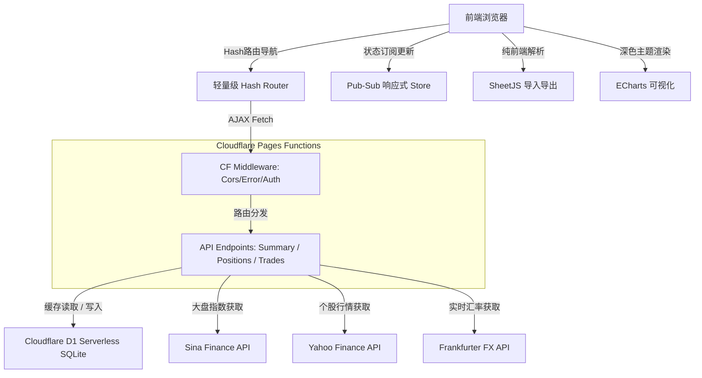

# StockVault 📈

<p align="center">
  
  
  
  
</p>

StockVault 是一个专为全球投资者打造的现代化股票持仓管理与分析系统。基于 **Cloudflare 生态（Pages + Functions + D1 SQLite）** 实现完全的 **Serverless** 部署，为您的 A股、港股、美股以及瑞士股票等多元化资产提供一站式的追踪、统计与可视化展示。

---

## ✨ 核心特性

- 🌍 **多市场覆盖**：原生支持 A股 (CNY)、港股 (HKD)、美股 (USD) 和瑞士市场 (CHF)，满足全球化资产配置需求。
- 💱 **智能实时汇率**：内置 Frankfurter 实时汇率 API 引擎，自动将所有外币资产转换为人民币 (CNY) 进行汇总计价与盈亏结算。
- 📊 **高级数据可视化**：基于 ECharts 构建全景可视化大屏，涵盖资产分布饼图、个股盈亏倒排条形图、市值矩形树图 (Treemap) 等，多维度剖析您的投资组合。
- 🎨 **极致视觉体验**：采用深色模式与拟态玻璃 (Glassmorphism) 材质设计，动效柔和，组件精致，提供极具现代感的金融终端级视觉体验。
- 🔄 **个性化偏好设置**：支持一键切换“红涨绿跌（国内）”与“绿涨红跌（国际）”两种颜色方案；支持配置全局行情自动轮询刷新时间。
- 📥 **灵活的数据流转**：纯前端集成 SheetJS，支持通过 CSV/Excel (.xlsx) 文件进行大规模历史交易记录的智能模糊表头映射批量导入，并提供详细的导入格式校验报错提示。
- 🎯 **多维度收益率追踪**：新增持仓天数、年化收益率与月收益率计算模型。仪表盘直观展示全局 YTD 收益率与总年化收益率，并可交互查看各分类市场的独立 YTD 与年化收益率。
- 📈 **闭环持仓分析**：在持仓管理面板支持对当前持仓及已平仓的历史交易进行年化收益率与准确的持仓时长分析。
- 📊 **独立图表分析栏目**：集中展现投资组合的深度资产轨迹，包含资产走势面积折线图（支持多时间维度缩放且完美渲染资产与成本线趋势）、YTD 各市场收益对比柱状图以及个股盈亏分布散点图。
- 💾 **Serverless 自动资产快照**：采用轻量级惰性写入 (Lazy Snapshot) 机制，自动将各个分市场及全局的最新成本、市值和 YTD 盈亏同步缓存至 D1 数据库，无感记录您的净值成长轨迹。
- 🔐 **云端安全代理**：接口请求全部经由边缘 Serverless 函数进行鉴权与安全过滤，且所有数据通过 Token 保护，彻底杜绝前端硬编码带来的泄露风险。

---

## 📅 版本更新日志

### v2.5.0 (2026-06-25)

#### 🔌 OpenClaw 智能体 API 支持与 API 密钥管理
- **🤖 OpenClaw 专属只读 API 接口**：
  - 在 `/api/openclaw/` 路径下新增了 8 个只读数据 API 端点，支持读取投资组合概要、当前持仓、个股详情、历史交易记录、市场概览、资产快照以及实时报价，方便 OpenClaw 或其他 MCP 智能体调用。
- **🔐 双重鉴权中间件升级**：
  - 重构了后端 `_middleware.js` 统一鉴权逻辑，同时支持前端常规 Cookie Session 会话校验与基于 SHA-256 哈希的 `Authorization: Bearer <API_KEY>` 智能体密钥校验。
- **⚙️ API 密钥自助管理界面**：
  - 在“系统设置”页面新增 OpenClaw API 密钥管理模块，支持用户自主生成、一键复制和随时撤销 API 密钥，保障云端接口安全性。

### v2.4.0 (2026-06-16)

#### 🚀 移动端深度适配与体验重构
- **📱 全新移动端导航体系**：
  - 彻底抛弃了传统的左侧抽屉式侧边栏，重构为符合移动端习惯的**底部悬浮 Tab 导航栏 (Bottom Tab Bar)**。
  - 支持 iOS 底部安全区 (`safe-area-inset-bottom`) 完美自适应。
  - 智能折叠不常用的菜单项至原生的"更多"弹出面板中，提供更宽广的内容视野。
- **📊 仪表盘移动端深度精简**：
  - 优化了 KPI 卡片与市场大盘布局，确保在手机端拥有更紧凑的信息密度（自动转换为"万"为单位显示）。
  - **盈亏排名移动化重塑**：去掉了原先庞大且需要滑动的 Echarts 柱状图，转为极简的原生 HTML "Top 盈利/Top 亏损"榜单，以股票代码直观并列展示。
  - **持仓明细反滚动设计**：在手机端隐去了名称、数量、现价、成本等非核心数据列，保留最关键的“代码、市值、盈亏、盈亏%”4列，从而**彻底消灭了手机端的横向滑屏**操作，做到一目了然。
- **⚙️ 全局版本号自动化联动**：
  - 构建系统升级，侧边栏界面的版本号显示现已与 `package.json` 中的系统版本号动态双向关联，一键构建自动同步更新。

### v2.3.0 (2026-06-11)

#### 🚀 新增功能与体验优化
- **🎯 优化市场专区与 API 精简**：
  - 针对 Finnhub 免费层级权限的变更，全面移除了不再支持的“目标价” (Price Target) 接口调用，同时下线了占用空间的“持仓新闻动态”与“分析师评级趋势”功能。
- **🎨 市场专区 UI 布局重构**：
  - 重新设计了美国市场专区的网格布局系统。采用优雅的非对称分栏布局，左侧主视觉区自适应展示“基本面指标”卡片流，右侧固定展示“财报日历”，彻底解决了原先由于模块精简带来的版面留白和占位突兀问题。
- **🐛 52 周区间与实时盈亏显示修复**：
  - 修复了数据层缓存优先级冲突导致的实时报价丢失 Bug，现在“基本面指标”卡片中的 52 周区间进度条能正确计算并标记实时股价位置，同时市场页面顶部概览表格的实时盈亏金额也恢复正常显示。

### v2.2.1 (2026-06-10)

#### 🚀 新增功能
- **🔌 外部 API 密钥集成 (设置页面)**：
  - 新增独立 API 设置项，支持用户自定义输入 **Finnhub API Key** 与 **Alpha Vantage API Key**，配置实时加密存储至 D1 数据库。
- **🌐 扩展全球资产获取 (Crypto / 外汇 / 贵金属)**：
  - 智能路由引擎现在支持通过 Finnhub API 获取加密货币与外汇/贵金属行情。
  - 支持输入 `BINANCE:BTCUSDT` 获取比特币，或 `OANDA:XAU_USD` 获取现货黄金。
  - 顶部行情跑马灯现已加入 **BTC** 和 **XAU/USD** 的实时报价。
- **📈 股票级 YTD 柱状图弹窗**：
  - 对仪表盘底部的 YTD 收益率卡片弹窗进行了深度重构，现已升级为基于 ECharts 的**各股票 YTD 收益排名**柱状图。
  - 能够直观地以绝对收益额从大到小倒序展示所有当年持有过（含当年已平仓）股票的 YTD 贡献表现。
- **💵 美元指数展示**：
  - 左下角的汇率实时展示条现已加入 **美元指数 (DXY)** 的同步获取与渲染显示。

### v2.2.0 (2026-06-02)

#### 🚀 新增功能
- **📈 独立图表分析页面**：
  - 新增**资产走势折线图**：支持查看近 30天、90天、半年及一年的资产变化曲线。通过 ECharts 双系列面积图直观展示「总资产市值」与「总持仓成本」的动态对比，支持空状态友好提示及高性能时间缩放。
  - 新增**YTD 各市场收益对比图**：横向对比美股、港股、A股与瑞士市场的 YTD 绝对盈亏金额。
  - 新增**持仓盈亏散点分布图**：以“市值”为 X 轴、“收益率”为 Y 轴、“持仓大小”为气泡大小，多维度剖析个股盈亏分布。
- **📅 投资组合级 YTD 收益率追踪**：
  - 支持计算包含已平仓交易在内的全局 YTD 收益（CNY）及 YTD 收益率。
  - 采用**跨年分批建仓算法**：对于去年末（或更早）建仓的持仓，以去年末收盘价（`ytd_price`）作为今年初的 YTD 基准；对于今年新买入的持仓，以买入价为基准，精确统计跨年分步持仓浮动盈亏。
  - 引入年初估值智能回退机制：当数据库中缺少去年末快照数据时，通过 `当前市值 - YTD 绝对收益 - 年内净投入` 自动反推年初估值，确保 YTD 收益率计算的科学合理性。
- **💾 D1 资产自动快照机制 (Lazy Snapshot)**：
  - 采用轻量级惰性写入设计，在每次获取 `api/summary` 时，自动在后台计算并异步写入当天各个分市场及全局的快照数据到 D1 数据库中。
  - 支持快照数据的每日幂等覆盖，保证同一天多次操作数据不重复、不冲突。
  - D1 数据库增加 `ytd_pnl_cny` 字段以支持记录分市场的 YTD 历史净值盈亏。

#### 🎨 界面与体验优化
- **🎯 仪表盘 KPI 面板重塑**：
  - 核心 KPI 卡片区第四张卡片替换为 **📅 YTD 收益率**（仅展示收益率百分比，保持界面简洁）。
  - 第五张卡片恢复为 **年化收益率**。
  - 点击 YTD 收益率卡片，可交互查看针对各独立市场（美股、港股等）计算出的**分市场 YTD 收益率**明细弹窗。
- **⚙️ 版本信息同步**：
  - 界面左下角侧边栏版本信息已同步更新为 `v2.2.0`。

---

## 🛠 技术栈

### 前端 (Frontend)
- **核心框架**: Vite + 原生 JavaScript (ESM) + Vanilla CSS (零重型依赖，页面毫秒级加载)
- **图表渲染**: ECharts (搭配专属定制深色主题)
- **数据解析**: SheetJS (`xlsx` 纯浏览器端解析)
- **设计风格**: 拟态玻璃材质 (Glassmorphism) + 全局 CSS 变量控制

### 后端与数据库 (Backend & Database)
- **边缘算力**: Cloudflare Pages Functions (基于 V8 Runtime 的 Serverless API)
- **云数据库**: Cloudflare D1 (全网分布式 Serverless SQLite)
- **三方集成**: 新浪财经 (大盘指数), Yahoo Finance (个股实时行情), Frankfurter (实时汇率)

---

## 📐 系统架构与核心设计



### 1. 轻量级 SPA 路由器 (`src/router/`)
系统自主实现了一个轻量级 Hash 路由器，具备以下核心能力：
- 支持路径参数匹配（例如 `/market/:id`）。
- 具有前置鉴权钩子 (`beforeEach`)，实现未登录状态的自动拦截与重定向。
- 配合 CSS 动画，在路由切换时提供平滑的页面淡入淡出过渡动画 (`page-enter` / `page-exit`)。

### 2. 发布订阅式状态机 (`src/store/`)
为了解决原生 JS 多组件间数据同步的难题，系统封装了基于 **发布-订阅模式** 的全局状态管理器（Store）：
- 分离了 `positionsStore`（持仓数据）、`marketStore`（实时行情）、`summaryStore`（盈亏统计）以及 `settingsStore`（个性化配置）。
- 支持属性级别的精细化订阅监听，确保了“一处数据修改，多处视图实时联动”。

### 3. 后端 Serverless 安全鉴权中间件 (`functions/api/`)
后端采用 Cloudflare Pages Functions 实现了安全的中间件拦截链（Middleware Chain）：
- **跨域与监控**: 提供 CORS 预检处理，并计算响应耗时写入 `X-Response-Time` 响应头中。
- **安全鉴权**: 除了登录接口外，所有数据操作接口均需通过统一的 Token 鉴权中间件，直接对接云端 D1 数据库进行校验，防范越权数据操纵。

### 4. 智能多源行情路由引擎 (`functions/api/stock/quote.js`)
为了规避各大数据源对海外云数据中心（尤其是 Cloudflare 边缘节点）的封锁，后端实现了一套极为鲁棒的智能路由策略：
- **全球大盘指数 (Indices)**：包括国内指数（如沪深300）、港股指数（恒指）以及美股指数（纳指、标普500），全部统一路由至抗封锁能力强、无需 API Key 且极度稳定的**新浪财经 API**。*(注：受限于美国交易所数据授权，所有公开免费接口的美股指数盘中均存在固定 15 分钟延时)*。
- **全球普通个股 (Stocks)**：所有普通的 A股、港股、美股等个股代码则路由至 **Yahoo Finance API** 获取实时行情与交易量。
- **回退机制与特例**：由于新浪等国内接口不提供有效的 VIX 恐慌指数（`^VIX`），该指数请求会被智能回退至 Yahoo Finance 进行获取。

---

## 🗄 数据库结构设计

系统数据库包含以下核心表结构：

* **`positions`** (持仓主表)：存储当前所有 OPEN/CLOSED 状态的持仓，包含开仓价、开仓汇率、数量、手续费、平仓结算信息、所属行业 (`sector`) 和系统性风险系数 (`beta`)。
* **`trades`** (交易明细表)：记录每一笔 BUY/SELL 指令的流水数据，与持仓主表进行外键级联。
* **`quote_cache`** (行情缓存表)：以股票代码为主键，缓存最新抓取的实时报价与昨收，以极大地减缓外部 API 限频并加速数据渲染。
* **`exchange_rates`** (汇率缓存表)：缓存人民币对主要外币的实时换算汇率。
* **`portfolio_snapshots`** (净值快照表)：每日定时保存每个市场及全局的总成本、总市值及总累计盈亏，为资产净值曲线提供数据基础。
* **`user_settings`** (用户配置表)：用于持久化存储系统偏好及加密凭证。

---

## 🧮 核心计算公式 (Calculations)

系统在底层进行多维度的数据统计时，采用了一系列严密的金融计算模型。以下是核心指标的计算方式说明：

### 1. 📅 YTD 收益率 (Year-To-Date Return)

为了解决因年中大额资金进出（如年中加仓）导致的收益率百分比失真，系统并没有简单倒推一个静态的年初资金，而是采用“YTD 成本基准”法（吸收了 Dietz 算法核心思想）来得出更符合真实本金占用的百分比：

* **YTD 绝对收益 (分子)**： `∑(所有当前持仓的今年内浮动盈亏) + ∑(今年内已平仓的实现盈亏)`
  * *注：对于去年及之前买入的仓位，以“去年末最后交易日收盘价 (`ytd_price`)”作为今年的起始成本基准；对于今年新买入的仓位，以“实际买入价”作为基准。此项精确包含今年内部分减仓或全部清仓（CLOSED）所产生的已实现盈亏。*
* **YTD 成本基准 (分母)**： `当前总资产市值 - 总体 YTD 绝对收益`
  * *数学上该公式严格等价于：`年初实际资产 + 年内净转入本金`。它能将年中买入股票所花费的本金一并纳入分母基数，彻底避免了“利润算入分子但缺少本金做分母”引起的收益率暴涨问题。*
* **最终公式**： `YTD 收益率 = (YTD 绝对收益 / YTD 成本基准) × 100%`

### 2. 🎯 年化收益率 (Annualized Return)

对于投资组合及单一持仓的年化计算，采用“资金时间加权”算法（**注：组合总年化收益率仅计算当前处于持有中 (OPEN) 状态的资产，不包含已彻底平仓的历史记录**）：

* **加权持仓天数**： `∑(单笔建仓价值 × 该笔持仓天数) / 总价值`
* **期间总收益率**： `(累计总盈亏 / 累计投入总成本) × 100%`
* **最终公式**： `年化收益率 = (期间总收益率 / 加权持仓天数) × 365天`

### 3. 💱 实时汇率换算损益 (Currency Conversion)

将非人民币资产（港股、美股、瑞股等）在汇总计算时，会通过实时汇率统一折算为 CNY：

* 系统在交易记录中持久化保存了建仓时的**历史开仓汇率**。
* 当前市值的计算使用 API 获取的**实时汇率**。
* 汇率变动产生的潜在损益（FX PnL）已自动无缝融合进持仓的总盈亏金额中，所见即最终的人民币净值变化。

---

## 🚀 部署指南 (Cloudflare)

本项目专门针对 Cloudflare 边缘网络生态优化，推荐采用完全托管的 Pages 方案部署。

### 1. 创建 Cloudflare D1 数据库
在您的本地项目根目录下，使用 Wrangler CLI 工具创建一个 D1 实例：
```bash
npx wrangler d1 create stockvault-db
```
创建成功后，复制终端输出的数据库配置段落，并覆盖更新项目根目录下的 `wrangler.toml` 文件：
```toml
[[d1_databases]]
binding = "DB"
database_name = "stockvault-db"
database_id = "您的-database-id-填在这里"
```

### 2. 初始化数据库表结构
在远程云数据库上执行 D1 SQL 脚本，建立数据表、索引及触发器：
```bash
npx wrangler d1 execute stockvault-db --file=./db/schema.sql --remote
```

### 3. 创建 Cloudflare Pages 项目
1. 登录 Cloudflare 控制台，进入 **Workers & Pages** -> **Create application** -> **Pages** -> **Connect to Git**。
2. 选择本项目的 GitHub 仓库。
3. **构建与输出设置**：
   - **Framework preset**: `Vite`
   - **Build command**: `npm run build`
   - **Build output directory**: `dist`
4. 点击 **Save and Deploy** 开始初次部署。

### 4. 自定义域名配置
部署完成后，进入该 Pages 项目：
- （可选）在 **Settings** -> **Custom domains** 面板中绑定您的专属自定义域名（如 `finance.example.com`）。

---

## 💻 本地开发调试

您可以在本地开发环境启动完整的边缘函数模拟环境：

```bash
# 1. 安装项目依赖
npm install

# 2. 初始化本地模拟 D1 数据库
npx wrangler d1 execute stockvault-db --file=./db/schema.sql --local

# 3. 启动本地 Wrangler 边缘代理开发服务器 (支持 Functions API 与本地静态资源热更新)
npx wrangler pages dev dist
```

---

## 📝 批量数据导入规范

在“导入导出”页面，您可以下载标准的 CSV 导入模板。
系统拥有极高的表头词义识别容错率，导入文件时会自动识别以下中英文表头列：

| 推荐表头 | 支持的同义表头名称 (大小写不敏感) | 是否必填 | 格式要求 |
| :--- | :--- | :--- | :--- |
| **股票代码** | `symbol`, `代码`, `ticker`, `code` | **是** | A股如 `600519.SHH`/`000001.SHZ`，美股如 `AAPL`，港股如 `0700.HKG` |
| **股票名称** | `name`, `股票名称`, `名称`, `stock_name` | **是** | 任意字符串，如 `贵州茅台` |
| **市场** | `market`, `市场`, `exchange`, `交易所` | **是** | 支持 `A股`/`A_SHARE`、`美股`/`US`、`港股`/`HK`、`瑞士`/`SWISS` |
| **交易类型** | `trade_type`, `交易类型`, `方向`, `side`, `action` | **是** | 支持 `买入`/`BUY`、`卖出`/`SELL` |
| **价格** | `price`, `价格`, `成交价`, `trade_price` | **是** | 大于 0 的数值 |
| **数量** | `quantity`, `数量`, `股数`, `shares` | **是** | 大于 0 的数值 |
| **日期** | `trade_date`, `日期`, `date`, `交易日期` | **是** | 支持 `YYYY-MM-DD`, `DD/MM/YYYY`, `YYYY年MM月DD日` 等常用日期格式 |
| **手续费** | `commission`, `手续费`, `佣金`, `fee` | 否 | 正数，缺省为 0 |
| **备注** | `notes`, `备注`, `remark`, `comment` | 否 | 任意备注信息 |
| **行业** | `sector`, `行业`, `industry`, `板块` | 否 | 行业类别，如 `科技`、`消费` |
| **贝塔值** | `beta`, `贝塔`, `贝塔值`, `β` | 否 | 数值，代表股票系统性风险系数 |

---

## 📄 开源协议

本项目作为开源或个人研究用途。所引用的第三方 API 均遵循其各自的服务条款。
